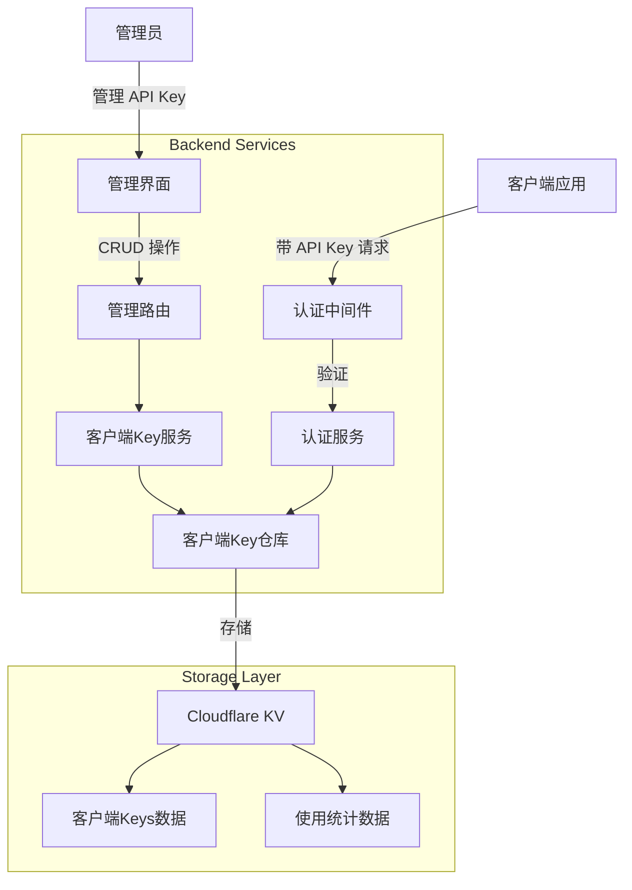
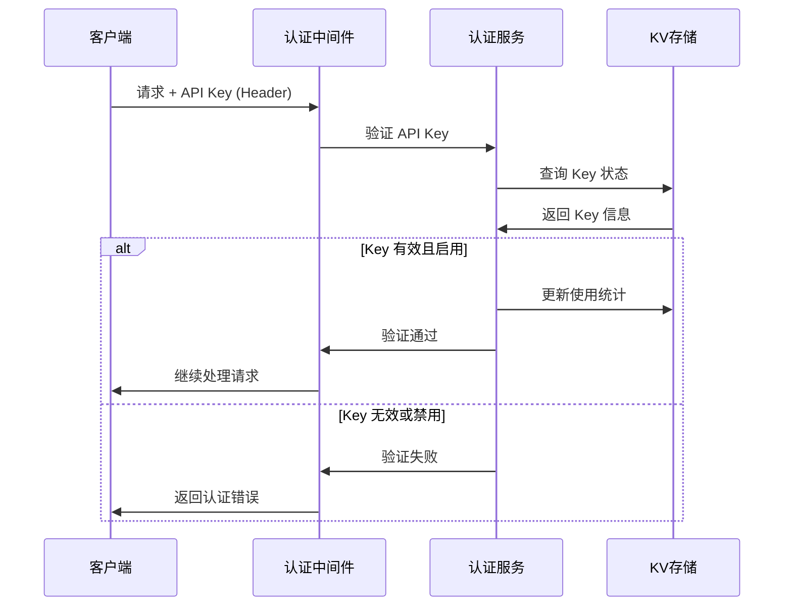

# Design Document

## Overview

客户端 API Key 管理系统是一个独立于供应商 API Key 管理的功能模块，用于生成、管理和验证客户端访问 Claude Relay 服务时使用的认证凭据。该系统采用现有的 Hono + Cloudflare Workers + KV 架构，遵循项目现有的分层设计模式。

## Architecture

### 系统架构图



### 认证流程



## Components and Interfaces

### 1. 数据访问层 (Repository)

**ClientApiKeyRepository**
- 负责客户端 API Key 的 CRUD 操作
- 使用 KV 存储，遵循现有的存储键命名模式
- 包含使用统计的读写功能

### 2. 业务服务层 (Service)

**ClientApiKeyService**
- 处理 API Key 的生成逻辑（使用加密安全的随机生成）
- 管理 Key 的生命周期（创建、更新、禁用、删除）
- 处理使用统计的更新和查询

**ClientApiKeyAuthService**  
- 提供 API Key 认证功能
- 集成到现有的请求处理流程中
- 记录和更新使用统计

### 3. 路由层 (Routes)

**Admin Routes (`/api/admin/client-keys`)**
- `GET /` - 获取所有客户端 API Key 列表
- `POST /` - 创建新的 API Key
- `GET /:keyId` - 获取特定 Key 的详细信息
- `PUT /:keyId` - 更新 Key 信息（描述、状态）
- `DELETE /:keyId` - 删除 Key
- `GET /:keyId/stats` - 获取使用统计

### 4. 中间件 (Middleware)

**ClientApiKeyMiddleware**
- 在现有认证流程中集成客户端 API Key 验证
- 支持多种认证方式的优雅降级
- 提供请求上下文中的客户端身份信息

### 5. 前端组件 (Frontend)

**页面组件**
- `/admin/client-keys` - API Key 管理主页面
- `/admin/client-keys/[keyId]` - Key 详情页面

**Vue 组件**
- `ClientKeyList.vue` - Key 列表展示
- `CreateKeyModal.vue` - 创建 Key 模态框
- `KeyStatsChart.vue` - 使用统计图表
- `KeyActionsDropdown.vue` - Key 操作下拉菜单

## Data Models

### ClientApiKey
```typescript
interface ClientApiKey {
  id: string                    // 唯一标识符
  key: string                   // API Key (生成后不可修改)
  description?: string          // 用户自定义描述
  status: 'active' | 'disabled' // 状态
  createdAt: number            // 创建时间戳
  lastUsedAt?: number          // 最后使用时间戳  
  usageCount: number           // 使用次数
  createdBy: string            // 创建者（管理员用户名）
}
```

### ClientApiKeyUsageStats
```typescript
interface ClientApiKeyUsageStats {
  keyId: string
  dailyUsage: Record<string, number>    // 按日期统计使用次数
  hourlyUsage: Record<string, number>   // 按小时统计（最近24小时）
  totalRequests: number                 // 总请求数
  lastUpdated: number                   // 最后更新时间
}
```

### API 请求/响应类型
```typescript
interface CreateClientKeyRequest {
  description?: string
}

interface CreateClientKeyResponse {
  id: string
  key: string
  description?: string
  status: string
  createdAt: number
}

interface UpdateClientKeyRequest {
  description?: string
  status?: 'active' | 'disabled'
}
```

## Error Handling

### 错误类型定义

**CLIENT_KEY_ERRORS**
```typescript
export const CLIENT_KEY_ERRORS = {
  KEY_NOT_FOUND: 'CLIENT_KEY_NOT_FOUND',
  KEY_DISABLED: 'CLIENT_KEY_DISABLED', 
  KEY_INVALID: 'CLIENT_KEY_INVALID',
  KEY_EXISTS: 'CLIENT_KEY_EXISTS',
  GENERATION_FAILED: 'CLIENT_KEY_GENERATION_FAILED'
} as const
```

### 错误处理策略

1. **认证错误**
   - 无效 Key: 返回 401 状态码
   - 已禁用 Key: 返回 403 状态码
   - 缺失 Key: 返回 401 状态码

2. **管理操作错误**
   - Key 不存在: 返回 404 状态码
   - 生成失败: 返回 500 状态码
   - 参数验证失败: 返回 400 状态码

3. **存储错误**
   - KV 写入失败: 重试机制 + 降级处理
   - 读取失败: 返回默认值或错误状态

## Testing Strategy

### 1. 单元测试
- **Repository 层**: 测试 KV 存储的读写操作
- **Service 层**: 测试业务逻辑和 Key 生成算法
- **认证中间件**: 测试各种认证场景

### 2. 集成测试
- **API 端点测试**: 完整的请求-响应流程测试
- **认证流程测试**: 端到端的客户端认证验证
- **使用统计测试**: 统计数据的准确性验证

### 3. 测试用例覆盖
- ✅ API Key 生成和唯一性
- ✅ CRUD 操作的完整流程  
- ✅ 认证成功和失败场景
- ✅ 状态管理（启用/禁用）
- ✅ 使用统计的准确更新
- ✅ 错误处理和边界条件

### 4. 性能测试
- Key 验证性能（高频访问场景）
- KV 存储读写性能
- 统计数据更新的异步处理

## Security Considerations

### 1. Key 生成安全
- 使用 `crypto.getRandomValues()` 生成高熵随机数
- Key 长度至少 32 字符
- 使用 Base64URL 编码确保 URL 安全

### 2. Key 存储安全  
- Key 在 KV 中以哈希形式存储（可选）
- 敏感操作需要管理员认证
- 定期轮换和清理过期 Key

### 3. 访问控制
- 只有认证的管理员可以管理 Key
- 客户端只能使用 Key，无法查看其他信息
- 审计日志记录所有管理操作

## Storage Schema

### KV Storage Keys

```typescript
// 客户端 API Key 相关存储键
export const CLIENT_API_KEY_STORAGE_KEYS = {
  // 所有 Key 的索引列表
  CLIENT_KEYS_INDEX: 'client_api_keys_index',
  
  // 单个 Key 详情
  CLIENT_KEY_PREFIX: 'client_api_key_',
  
  // 使用统计
  CLIENT_KEY_STATS_PREFIX: 'client_api_key_stats_',
  
  // Key 到 ID 的映射（用于快速查找）
  CLIENT_KEY_MAPPING_PREFIX: 'client_api_key_map_'
} as const
```

### 存储结构设计

1. **Keys Index**: 存储所有 Key ID 的列表，用于快速遍历
2. **Key Details**: 每个 Key 的详细信息单独存储
3. **Usage Stats**: 使用统计数据分离存储，支持高频更新
4. **Key Mapping**: Key 字符串到 ID 的映射，用于认证时的快速查找

## Integration Points

### 1. 与现有认证系统集成
- 在现有的管理员认证基础上添加客户端认证
- 保持现有的错误处理和响应格式一致性
- 复用现有的中间件和工具函数

### 2. 与代理服务集成
- 在 Claude 代理请求处理前加入客户端认证检查
- 在使用统计中记录代理请求的相关信息
- 支持按客户端进行请求监控和限流（未来扩展）

### 3. 与前端管理界面集成
- 在现有管理界面中新增客户端 Key 管理模块
- 复用现有的 UI 组件和样式系统
- 保持与其他管理功能的界面一致性